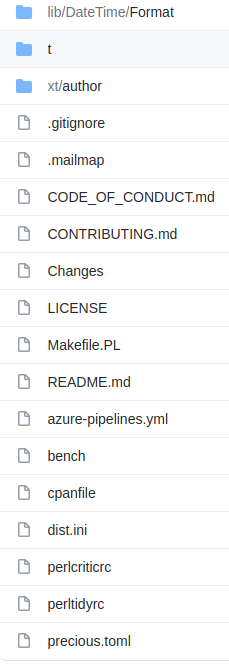

# Dist::Zilla and My Bundle

## [Dave Rolsky](http://blog.urth.org)

https://github.com/autarch/presentations  
(dzil-and-my-bundle)

------

# What is Dist::Zilla?

Note:
* A tool to automate distro maintenance for CPAN authors
* But what does that mean?

------

# Take a Step Back First

------

# What's in a CPAN Distribution?

Note:
* The code itself
* Docs
* Test code
* Installer code, like `Makefile.PL`
* Metadata
* Other stuff

------

From `DateTime::Format::Strptime`:



------

# What Goes Into a New Release?

Note:
* Update `$VERSION`
* Update Changes
* Make sure metadata is up to date
* Include important files like `Makefile.PL`
* Include useful files like `cpanfile` or `perltidyrc`

------

# Dist::Zilla Automates Away Boilerplate

Note:
* `Makefile.PL` and other files
* Standard POD sections - `SUPPORT`, `COPYRIGHT`, etc.

------

# Dist::Zilla Standardizes All Your Releases

Note:
* I want every distro to include:
  * POD syntax tests
  * POD spelling tests
  * Compilation tests
  * Up to date dependency information
* I don't want to copy these files between distros
* I *definitely* don't want to update 50 distros when I change how my POD syntax tests work

------

# How to Use It?

------

# Make a New Distro

```sh
$> dzil new My-Distro
$> cd My-Distro
```

Note:
* Makes a new distro with some default files

------

# Hack, Hack, Hack

```sh
$> dzil test --all
```

Note:
* All tests means the tests you intend others to run, as well as author-only
  tests.
* Author-only tests might include:
  * POD syntax tests
  * Testing to make sure you used spaces instead of tabs because you're not a monster
  * Testing that your Changes file is up to date when doing a release
  * Lots more stuff

------

# We Have Some Code to Release

```sh
$> dzil release
```

Note:

------

# What's in My Bundle?

------

# A lot!

Note:
* About 50 plugins

------

# What's My Bundle Do?

------

# Custom Makefile.PL Generator

Note:
* Adds `-Wall` and `-Werror` to XS code when I'm running tests

------

# AutoPrereqs

Note:
* Scans code for prereqs

------

# Adds extra prereqs

Note:
* If my distro uses `Test2` it requires a `Test::More` with `Test2`
* Otherwise it requires a `Test::More` with `subtest` support
* Adds linting modules as develop phase requirements

------

# GitHub Integration

Note:
* Sets some metadata like repo from GitHub info
* Updates GitHub to link to MetaCPAN

------

# Many, Many Test Generators

Note:
* Pod syntax test
* Pod coverage test
* Mojibake test
* Clean namespaces
* Format of Changes file
* Test that the `META.json` file follows the CPAN Meta spec
* EOL/whitespace test
* No tabs
* Filename portability
* Synopsis
* Runs precious to check that all files pass linting checks
* Compilation
* A "test" that reports prereqs
* Check that versions are sane in all modules

------

## What Else?

Note:
* File generation (Contribution and Install guides + Code of Conduct)
* Doc generation
* Runs all tests before a release
* Does some other release checks
  * Is Changes updated?
  * Do I have the newest versions of my prereqs installed
  * Are all my prereqs on CPAN?
  * Are there and merge conflict markers in my source?
  * Is this the master branch (for stable releases)?
* Updates Changes with a release date

------

# And What Else?

Note:
* Does the release itself
* Tags release in git
* Copies generated files back to the repo
  * So casual contributors don't need dzil
* Commits generated files
* Bumps `$VERSION` in all modules
* Commits `$VERSION` bump
* Pushes tag and commits

------

# Integration with Pod::Weaver

Note:
* Pod::Weaver is dzil for Pod
  * Pod munging and generation
  * Lots of plugins
* This is insane
* `Pod::Weaver` also supports bundles
* `Dist::Zilla` can be configured to invoke `Pod::Weaver`
* There is no sane way to pass config from `Dist::Zilla` to `Pod::Weaver`

------

# The Insane Way

```perl
use PadWalker qw( peek_sub );

sub configure {
    my $self = shift;
    
    my $podweaver_plugin
        = ${ peek_sub( \&Dist::Zilla::Plugin::PodWeaver::weaver )
                 ->{'$self'} };
    my $zilla = $podweaver_plugin->zilla;

    ...
    
    my $config
        = $zilla->plugin_named( $bundle_prefix
            . '/DROLSKY::WeaverConfig' );
```

------

# Bonus Slides

------

# What's In My `Pod::Weaver` Bundle?

Note:
* Ensure an `=encoding UTF-8` at the start of Pod
* Handle `:list` and `:verbatim` sections
* Place the header at the top
* Generates `Name` and `Version` sections
* Inserts `:prelude` section, if any
* `SYNOPSIS`, `DESCRIPTION`, `OVERVIEW`
* `=attr`, `=method`, `=func`, and `=type`

------

# What Else Is In My `Pod::Weaver` Bundle?

Note:
* Inserts `:postlude` section, if any
* Generates a `SUPPORT` section if none is already there
* Generates a `SOURCE` section
* Generates a `DONATIONS` section if I'm the distro's copyright holder
* Generates `AUTHORS`, `CONTRIBUTORS`, and `LEGAL` sections.
* Inserts `:footer` section, if any

------

# Other Bundles to Check Out

* [`Dist::Zilla::PluginBundle::Author::ETHER`](https://metacpan.org/release/Dist-Zilla-PluginBundle-Author-ETHER)
* [`Dist::Zilla::PluginBundle::YANICK`](https://metacpan.org/pod/Dist::Zilla::PluginBundle::YANICK)

Note:
* Do not use mine or anyone else's directly unless you love risk

------

# Questions?
