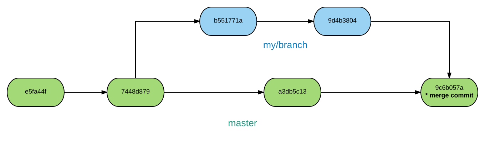
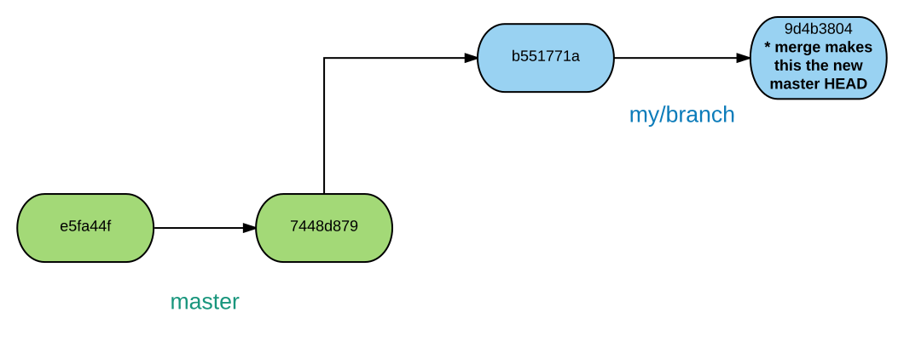
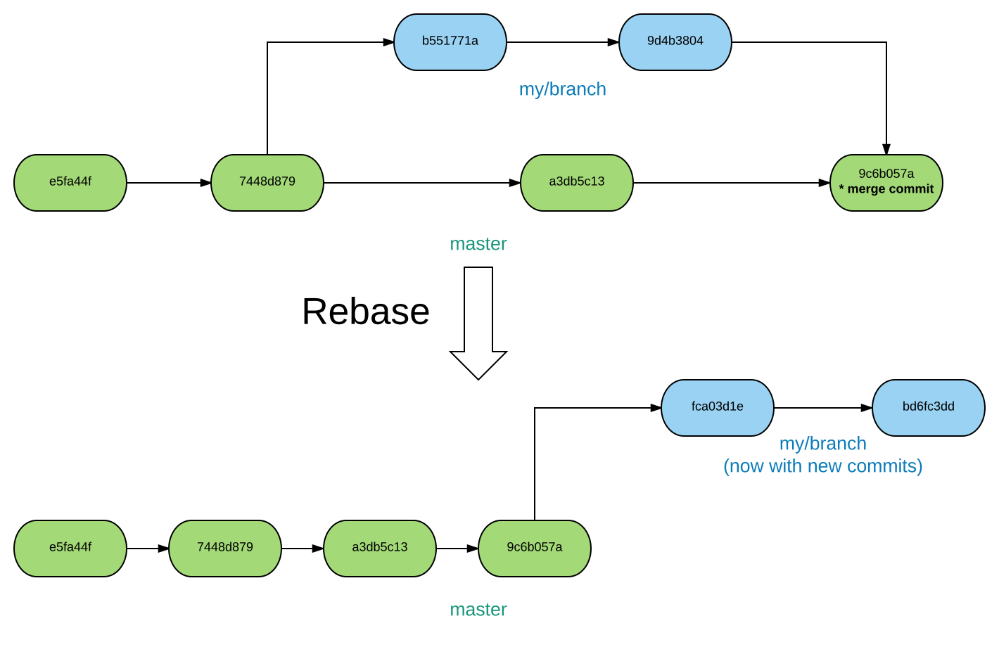

# Git Down,<br>Make Code

## Dave Rolsky

------

# Git is Simple

------

# Git is Just a Directed Acyclic Graph of Commits

------

## "Git is fundamentally a content-addressable filesystem with a VCS user interface written on top of it"

------

# Questions?

------

# But Seriously ...

------

## Repository

* A set of commits
* And references to those commits
  * A branch is a named reference that moves
  * A tag is a named reference that doesn't move

------

## Commit

* A record of all the files at a point in time
* A pointer to its parent commit(s)
* A SHA1 id

------

## Branch

* A reference to a commit that moves as you commit
* Master is just another branch

------

## Local Versus Remote

* Each repo is a full copy of all the commits
* Repos can be synced with `push` and `fetch`
* Each repo is just a set of commits & refs

------

## Working Directory

* Working directory tracks your current branch
* May contain unstaged changes

------

## Staging Area

* AKA "the index"
* Where things live after `git add`, `rm`, `mv`
* Ready for `git commit`

------

## Merging

* Merges (usually) create a commit with two parents



------

## Fast Forward Merge

* Sometimes a merge is a "fast forward" merge



------

## Rebase

* Replays your commits to make a fast forward merge

------



------

# Using Git

------

## Fetch vs Pull

* `git fetch` - synchronize local repo with remote
  * Doesn't change your working directory or your local branch

------

## Fetch vs Pull

* `git pull` - synchronize + merge
  * Equivalent to:

```
$> git fetch
$> git merge origin/$branch
```

------

## Fetch vs Pull

* `git pull --rebase` - synchronize + rebase local against remote
  * Equivalent to:

```
$> git fetch
$> git rebase origin/$branch
```

------

## The Stash

* `git stash`
  * Saves all local changes to the "stash"
  * Includes both staging area & working directory
* `git stash pop`
  * Gets the most recent set of changes off the stash
* `git stash list`

------

## `git diff --cached`

* Show staged changes in `diff` form

------

## `git commit --amend`

* Lets you edit the commit message of the most recent commit
* Will also include the contents of the index in the last commit

------

## `git add -p`

* Interactive partial add

```
diff --git a/git/index.md b/git/index.md
index 25167aa..83107b9 100644
--- a/git/index.md
+++ b/git/index.md
@@ -156,7 +156,7 @@ $> git rebase origin/$branch
 
 ------
 
-## `git commit -p`
+## `git add -p`
 
 * Interactive partial add
 
Stage this hunk [y,n,q,a,d,/,e,?]? 
```

------

## Commit Refs

* Refs are aliases to commits
* `HEAD` - the most recent commit in the current checkout
* `HEAD~3` - 3 commits back from the current `HEAD`
* `master@{yesterday}` - master

------

## `git rebase -i`

* Interactive rebase

```
pick d8a0f92 APyFC2.1: Add relocation path for the .bat files in c:\PythonX.X\Scripts for Windows.
pick 27a111e APyFC2.1: Forgot to add "then" for IF statement.
....

# Rebase 15f3dab..de899c5 onto 15f3dab (21 command(s))
#
# Commands:
# p, pick = use commit
# r, reword = use commit, but edit the commit message
# e, edit = use commit, but stop for amending
# s, squash = use commit, but meld into previous commit
# f, fixup = like "squash", but discard this commit's log message
# x, exec = run command (the rest of the line) using shell
# d, drop = remove commit
#
# These lines can be re-ordered; they are executed from top to bottom.
#
# If you remove a line here THAT COMMIT WILL BE LOST.
#
# However, if you remove everything, the rebase will be aborted.
#
# Note that empty commits are commented out
```

------

## `git rebase -i`

* Can rebase a branch against itself
* `git rebase -i HEAD~4`
    * Rebase the last four commits

------

## `git reset`

* Bare `git reset`
    * Unstage anything in the index
* `git reset -p`
    * Interactively unstage hunks
* `git reset --hard $COMMIT_REF`
    * Forcibly reset index and working directory to `$COMMIT_REF`
* `git reset --hard origin/master`

------

## `git reflog`

* Low level record of everything you've done

```
15f3dab HEAD@{0}: checkout: moving from i-shenl/ActivePython-FC2.1 to master
de899c5 HEAD@{1}: rebase -i (finish): returning to refs/heads/i-shenl/ActivePython-FC2.1
de899c5 HEAD@{2}: rebase -i (start): checkout HEAD~4
de899c5 HEAD@{3}: checkout: moving from master to i-shenl/ActivePython-FC2.1
15f3dab HEAD@{4}: checkout: moving from daver/mac-python-tests-take-2 to master
e1fc839 HEAD@{5}: checkout: moving from daver/patch-maker-tool to daver/mac-python-tests-take-2
1e1c06a HEAD@{6}: checkout: moving from master to daver/patch-maker-tool
15f3dab HEAD@{7}: checkout: moving from daver/git-lfs-checks to master
```

------

## `git rerere`

* https://git-scm.com/blog/2010/03/08/rerere.html
* Record conflict resolution and re-apply later
* Useful for rebases with the same recurring conflicts

------

## Questions?
