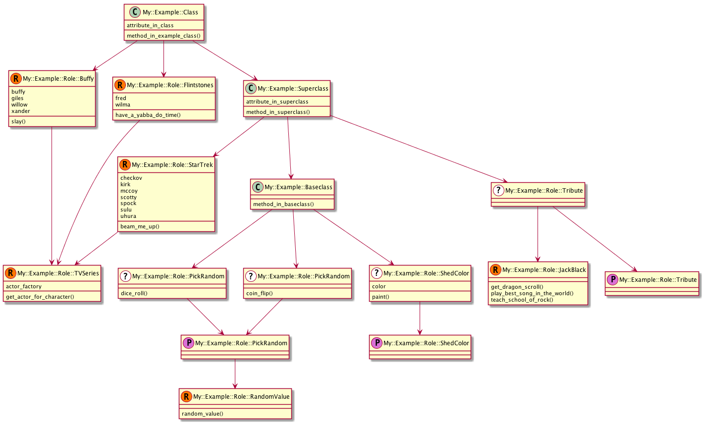

# Some Modules I've Released Recently(-ish)

## Dave Rolsky

------

## App-CISetup

* Travis and AppVeyor file management

```
$ setup-travis-yml.pl --dir .
DateTime-Locale/.travis.yml
DateTime-TimeZone/.travis.yml
DateTime.pm/.travis.yml

$ setup-travis-yml.pl --dir . --create
Created .travis.yml
```

------

## RTx-ToGitHub

* Convert all your RT tickets to GitHub issues

```
$ cd Some-GH-Repo
$ rt-to-github.pl 
GitHub user: [autarch] 
...
```

------

## Params-ValidationCompiler

* Sequel to `Params::Validate` (and `MooseX::Params::Validate`)
* Much faster
* Works with `Moose`, `Type::Tiny`, and `Specio`

------

## Meta-Grapher-Moose

```
$ graph-meta.pl \
  --package='My::Package::Name' \
  --output='diagram.png' \
  --renderer=plantuml
```

------


