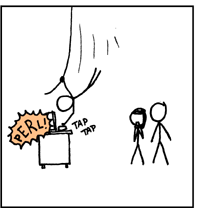

# Generating Rust from C with Perl

## [Dave Rolsky](http://blog.urth.org)

https://github.com/autarch/presentations  
(rust-from-c-with-perl)

------

## The Background

https://github.com/houseabsolute/pg-pretty

Note:
* A postgres SQL pretty printer written in Rust

------

# The Available Tools

* [`libpg_query`](https://github.com/pganalyze/libpg_query)
    * the Pg parser extracted as a C library
* [`libpg_query-sys`](https://lib.rs/crates/libpg_query-sys)
    * a Rust wrapper around that library

------

# But ...

* The parser just returns a JSON string!

```json
[
    {
        "RawStmt": {
            "stmt": {
                "SelectStmt": {
                    "op": 0,
                    "fromClause": [
                        {
                            "RangeVar": {
                                "location": 14,
                                "relpersistence": "p",
                                "inh": true,
                                "relname": "x"
                            }
                        },
                        {
                            "RangeVar": {
                                "location": 17,
                                "relpersistence": "p",
                                "inh": true,
                                "relname": "y"
                            }
                        },
                        {
                            "RangeVar": {
                                "location": 20,
                                "relpersistence": "p",
                                "inh": true,
                                "relname": "z"
                            }
                        }
                    ],
                    "targetList": [
                        {
                            "ResTarget": {
                                "location": 7,
                                "val": {
                                    "ColumnRef": {
                                        "location": 7,
                                        "fields": [
                                            {
                                                "A_Star": {
                                                }
                                            }
                                        ]
                                    }
                                }
                            }
                        }
                    ]
                }
            }
        }
    }
]
 ```

------

# The Goal

* Turn that JSON into Rust data structures
* **We need An AST!**

------

## How Many Node Types Do We Need?

* For Pg 10, we need 218

```rust
    AArrayExpr
    AConst
    AExpr
    AIndices
    AIndirection
    AStar
    AccessPriv
    Aggref
    Alias
    AlterCollationStmt
    AlterDatabaseSetStmt
    AlterDatabaseStmt
    AlterDefaultPrivilegesStmt
    AlterDomainStmt
    AlterEnumStmt
    AlterEventTrigStmt
    AlterExtensionContentsStmt
    AlterExtensionStmt
    AlterFdwStmt
    AlterForeignServerStmt
    AlterFunctionStmt
    AlterObjectDependsStmt
    AlterObjectSchemaStmt
    AlterOpFamilyStmt
    AlterOperatorStmt
    AlterOwnerStmt
    AlterPolicyStmt
    AlterPublicationStmt
    AlterRoleSetStmt
    AlterRoleStmt
    AlterSeqStmt
    AlterSubscriptionStmt
    AlterSystemStmt
    AlterTSConfigurationStmt
    AlterTSDictionaryStmt
    AlterTableCmd
    AlterTableMoveAllStmt
    AlterTableSpaceOptionsStmt
    AlterTableStmt
    AlterUserMappingStmt
    AlternativeSubPlan
    ArrayCoerceExpr
    ArrayExpr
    ArrayRef
    BitString
    BoolExpr
    BooleanTest
    CaseExpr
    CaseTestExpr
    CaseWhen
    CheckPointStmt
    ClosePortalStmt
    ClusterStmt
    CoalesceExpr
    CoerceToDomain
    CoerceToDomainValue
    CoerceViaIO
    CollateClause
    CollateExpr
    ColumnDef
    ColumnRef
    CommentStmt
    CommonTableExpr
    CompositeTypeStmt
    Const
    Constraint
    ConstraintsSetStmt
    ConvertRowtypeExpr
    CopyStmt
    CreateAmStmt
    CreateCastStmt
    CreateConversionStmt
    CreateDomainStmt
    CreateEnumStmt
    CreateEventTrigStmt
    CreateExtensionStmt
    CreateFdwStmt
    CreateForeignServerStmt
    CreateForeignTableStmt
    CreateFunctionStmt
    CreateOpClassItem
    CreateOpClassStmt
    CreateOpFamilyStmt
    CreatePLangStmt
    CreatePolicyStmt
    CreatePublicationStmt
    CreateRangeStmt
    CreateRoleStmt
    CreateSchemaStmt
    CreateSeqStmt
    CreateStatsStmt
    CreateStmt
    CreateSubscriptionStmt
    CreateTableAsStmt
    CreateTableSpaceStmt
    CreateTransformStmt
    CreateTrigStmt
    CreateUserMappingStmt
    CreatedbStmt
    CurrentOfExpr
    DeallocateStmt
    DeclareCursorStmt
    DefElem
    DefineStmt
    DeleteStmt
    DiscardStmt
    DoStmt
    DropOwnedStmt
    DropRoleStmt
    DropStmt
    DropSubscriptionStmt
    DropTableSpaceStmt
    DropUserMappingStmt
    DropdbStmt
    ExecuteStmt
    ExplainStmt
    Expr
    FetchStmt
    FieldSelect
    FieldStore
    Float
    FromExpr
    FuncCall
    FuncExpr
    FunctionParameter
    GrantRoleStmt
    GrantStmt
    GroupingFunc
    GroupingSet
    ImportForeignSchemaStmt
    IndexElem
    IndexStmt
    InferClause
    InferenceElem
    InlineCodeBlock
    InsertStmt
    Integer
    IntoClause
    JoinExpr
    ListenStmt
    LoadStmt
    LockStmt
    LockingClause
    MinMaxExpr
    MultiAssignRef
    NamedArgExpr
    NextValueExpr
    NotifyStmt
    Null
    NullTest
    ObjectWithArgs
    OnConflictClause
    OnConflictExpr
    OpExpr
    Param
    ParamRef
    PartitionBoundSpec
    PartitionCmd
    PartitionElem
    PartitionRangeDatum
    PartitionSpec
    PrepareStmt
    Query
    RangeFunction
    RangeSubselect
    RangeTableFunc
    RangeTableFuncCol
    RangeTableSample
    RangeTblEntry
    RangeTblFunction
    RangeTblRef
    RangeVar
    ReassignOwnedStmt
    RefreshMatViewStmt
    ReindexStmt
    RelabelType
    RenameStmt
    ReplicaIdentityStmt
    ResTarget
    RoleSpec
    RowCompareExpr
    RowExpr
    RowMarkClause
    RuleStmt
    SQLValueFunction
    ScalarArrayOpExpr
    SecLabelStmt
    SelectStmt
    SetOperationStmt
    SetToDefault
    SortBy
    SortGroupClause
    #[serde]
    StringStruct
    SubLink
    SubPlan
    TableFunc
    TableLikeClause
    TableSampleClause
    TargetEntry
    TransactionStmt
    TriggerTransition
    TruncateStmt
    TypeCast
    TypeName
    UnlistenStmt
    UpdateStmt
    VacuumStmt
    Var
    VariableSetStmt
    VariableShowStmt
    ViewStmt
    WindowClause
    WindowDef
    WindowFunc
    WithCheckOption
    WithClause
    XmlExpr
    XmlSerialize
```

------

## The Node for `SELECT`


```rust
pub struct SelectStmt {
    // NULL, list of DISTINCT ON exprs, or
    // lcons(NIL,NIL) for all (SELECT DISTINCT)
    #[serde(rename = "distinctClause")]
    pub distinct_clause: Option<Vec<Option<Node>>>,
    // target for SELECT INTO
    #[serde(rename = "intoClause")]
    pub into_clause: Option<IntoClauseWrapper>,
    // the target list (of ResTarget)
    #[serde(rename = "targetList")]
    pub target_list: Option<List>,
    // the FROM clause
    #[serde(rename = "fromClause")]
    pub from_clause: Option<List>,
    // WHERE qualification
    #[serde(rename = "whereClause")]
    pub where_clause: Option<Box<Node>>,
    // GROUP BY clauses
    #[serde(rename = "groupClause")]
    pub group_clause: Option<List>,
    // HAVING conditional-expression
    #[serde(rename = "havingClause")]
    pub having_clause: Option<Box<Node>>,
    // WINDOW window_name AS (...), ...
    #[serde(rename = "windowClause")]
    pub window_clause: Option<List>,
    // untransformed list of expression lists
    #[serde(rename = "valuesLists")]
    pub values_lists: Option<Vec<List>>,
    // sort clause (a list of SortBy's)
    #[serde(rename = "sortClause")]
    pub sort_clause: Option<Vec<SortByWrapper>>,
    // # of result tuples to skip
    #[serde(rename = "limitOffset")]
    pub limit_offset: Option<Box<Node>>,
    // # of result tuples to return
    #[serde(rename = "limitCount")]
    pub limit_count: Option<Box<Node>>,
    // FOR UPDATE (list of LockingClause's)
    #[serde(rename = "lockingClause")]
    pub locking_clause: Option<Vec<LockingClauseWrapper>>,
    // WITH clause
    #[serde(rename = "withClause")]
    pub with_clause: Option<WithClauseWrapper>,
    // type of set op
    pub op: SetOperation,
    // ALL specified?
    #[serde(default)]
    pub all: bool,
    // left child
    pub larg: Option<Box<SelectStmtWrapper>>,
    // right child
    pub rarg: Option<Box<SelectStmtWrapper>>,
}
```

------

## How to Get There?

* Writing this by hand would be ...
    * slow
    * tedious
    * error prone
    * a very bad idea

------

## Thank you, `libpg_query`

* Has JSON files for all the parser's C types:

```json
{
    "SelectStmt": {
        "fields": [
            {
                "comment": null,
                "c_type": "NodeTag",
                "name": "type"
            },
            {
                "comment": ""
            },
            {
                "comment": "	/*
	 * These fields are used only in \"leaf\" SelectStmts.
	 */
"
            },
            {
                "comment": "/* NULL, list of DISTINCT ON exprs, or
								 * lcons(NIL,NIL) for all (SELECT DISTINCT) */
",
                "c_type": "List*",
                "name": "distinctClause"
            },
            {
                "comment": "/* target for SELECT INTO */",
                "c_type": "IntoClause*",
                "name": "intoClause"
            },
            {
                "comment": "/* the target list (of ResTarget) */",
                "c_type": "List*",
                "name": "targetList"
            },
            {
                "comment": "/* the FROM clause */",
                "c_type": "List*",
                "name": "fromClause"
            },
            {
                "comment": "/* WHERE qualification */",
                "c_type": "Node*",
                "name": "whereClause"
            },
            {
                "comment": "/* GROUP BY clauses */",
                "c_type": "List*",
                "name": "groupClause"
            },
            {
                "comment": "/* HAVING conditional-expression */",
                "c_type": "Node*",
                "name": "havingClause"
            },
            {
                "comment": "/* WINDOW window_name AS (...), ... */",
                "c_type": "List*",
                "name": "windowClause"
            },
            {
                "comment": ""
            },
            {
                "comment": "	/*
	 * In a \"leaf\" node representing a VALUES list, the above fields are all
	 * null, and instead this field is set.  Note that the elements of the
	 * sublists are just expressions, without ResTarget decoration. Also note
	 * that a list element can be DEFAULT (represented as a SetToDefault
	 * node), regardless of the context of the VALUES list. It's up to parse
	 * analysis to reject that where not valid.
	 */
"
            },
            {
                "comment": "/* untransformed list of expression lists */",
                "c_type": "List*",
                "name": "valuesLists"
            },
            {
                "comment": ""
            },
            {
                "comment": "	/*
	 * These fields are used in both \"leaf\" SelectStmts and upper-level
	 * SelectStmts.
	 */
"
            },
            {
                "comment": "/* sort clause (a list of SortBy's) */",
                "c_type": "List*",
                "name": "sortClause"
            },
            {
                "comment": "/* # of result tuples to skip */",
                "c_type": "Node*",
                "name": "limitOffset"
            },
            {
                "comment": "/* # of result tuples to return */",
                "c_type": "Node*",
                "name": "limitCount"
            },
            {
                "comment": "/* FOR UPDATE (list of LockingClause's) */",
                "c_type": "List*",
                "name": "lockingClause"
            },
            {
                "comment": "/* WITH clause */",
                "c_type": "WithClause*",
                "name": "withClause"
            },
            {
                "comment": ""
            },
            {
                "comment": "	/*
	 * These fields are used only in upper-level SelectStmts.
	 */
"
            },
            {
                "comment": "/* type of set op */",
                "c_type": "SetOperation",
                "name": "op"
            },
            {
                "comment": "/* ALL specified? */",
                "c_type": "bool",
                "name": "all"
            },
            {
                "comment": "/* left child */",
                "c_type": "SelectStmt*",
                "name": "larg"
            },
            {
                "comment": "/* right child */",
                "c_type": "SelectStmt*",
                "name": "rarg"
            },
            {
                "comment": "	/* Eventually add fields for CORRESPONDING spec here */
"
            }
        ]
    }
}
```

------

## How to Turn That JSON Into Rust?



<small>Image copyright 2021 Randall Munroe</small>
<small>Image is licensed under a [Creative Commons Attribution-NonCommercial 2.5 License](http://creativecommons.org/licenses/by-nc/2.5/)</small>

------

## Does What You'd Expect

* Reads the JSON files
* Writes Rust structs & enums
* Lets me focus on the interesting parts of the project

------

## Mapping C to Rust - Optional Fields

* In a C struct, is a `*char` or `*Node` field optional?
* Who knows?!
* Rust has `String` and `Option<String>`
* Could just make Rust struct fields `Option<Foo>`
    * ... but that's annoying

------

## How to Figure This Out?

* Spelunking the Pg grammar
    * `src/backend/parser/gram.y`

```
table_ref:	relation_expr opt_alias_clause
				{
					$1->alias = $2;
					$$ = (Node *) $1;
				}
			| relation_expr opt_alias_clause tablesample_clause
				{
					RangeTableSample *n = (RangeTableSample *) $3;
					$1->alias = $2;
					/* relation_expr goes inside the RangeTableSample node */
					n->relation = (Node *) $1;
					$$ = (Node *) n;
				}
			| func_table func_alias_clause
```

------

## How to Figure This Out?

* Look at every spot that makes that struct in the grammar
    * Is the field always set?
* This is fun
* So fun
* Maybe I need a yacc/C parser to extract this information?

------

## Understanding the Structs

```rust
pub struct SelectStmt {
    // NULL, list of DISTINCT ON exprs, or
    // lcons(NIL,NIL) for all (SELECT DISTINCT)
    #[serde(rename = "distinctClause")]
    pub distinct_clause: Option<Vec<Option<Node>>>,
    // target for SELECT INTO
    #[serde(rename = "intoClause")]
    pub into_clause: Option<IntoClauseWrapper>,
    // the target list (of ResTarget)
    #[serde(rename = "targetList")]
    pub target_list: Option<List>,
    // the FROM clause
    #[serde(rename = "fromClause")]
    pub from_clause: Option<List>,
    // WHERE qualification
    #[serde(rename = "whereClause")]
    pub where_clause: Option<Box<Node>>,
    // GROUP BY clauses
    #[serde(rename = "groupClause")]
    pub group_clause: Option<List>,
    // HAVING conditional-expression
    #[serde(rename = "havingClause")]
    pub having_clause: Option<Box<Node>>,
    // WINDOW window_name AS (...), ...
    #[serde(rename = "windowClause")]
    pub window_clause: Option<List>,
    // untransformed list of expression lists
    #[serde(rename = "valuesLists")]
    pub values_lists: Option<Vec<List>>,
    // sort clause (a list of SortBy's)
    #[serde(rename = "sortClause")]
    pub sort_clause: Option<Vec<SortByWrapper>>,
    // # of result tuples to skip
    #[serde(rename = "limitOffset")]
    pub limit_offset: Option<Box<Node>>,
    // # of result tuples to return
    #[serde(rename = "limitCount")]
    pub limit_count: Option<Box<Node>>,
    // FOR UPDATE (list of LockingClause's)
    #[serde(rename = "lockingClause")]
    pub locking_clause: Option<Vec<LockingClauseWrapper>>,
    // WITH clause
    #[serde(rename = "withClause")]
    pub with_clause: Option<WithClauseWrapper>,
    // type of set op
    pub op: SetOperation,
    // ALL specified?
    #[serde(default)]
    pub all: bool,
    // left child
    pub larg: Option<Box<SelectStmtWrapper>>,
    // right child
    pub rarg: Option<Box<SelectStmtWrapper>>,
}
```

* Has 18 fields
* Many of which are Node, meaning "any AST node"

------

## ETOOMUCHNODE

* Many fields are `Node` or `List` (a list of `Node`)
* In most cases, can't really be _any_ node.
* A `SELECT` won't contain a `CREATE TABLE` in the `WHERE` clause.

------

## Back to Spelunking the Pg grammar

* Look at `where_clause` definition

```
where_clause:
			WHERE a_expr    { $$ = $2; }
			| /*EMPTY*/     { $$ = NULL; }
		;
```

------

## What's an `a_expr`?

```
a_expr:     c_expr  { $$ = $1; }
            | a_expr TYPECAST Typename
                    { $$ = makeTypeCast($1, $3, @2); }
            | a_expr COLLATE any_name
                {
                    CollateClause *n = makeNode(CollateClause);
                    n->arg = $1;
                    n->collname = $3;
                    n->location = @2;
                    $$ = (Node *) n;
                }
            | ...
```

* This continues for 400 lines
* I give up, `Node` is fine.

------

## But Sometimes I Can Narrow it Down

* `Node` -> more specific enum type
    * only allow specific nodes
* `List` -> `Vec<MoreSpecificType>`

------

## Still To Do

* Make the formatting code not terrible
* Handle dozens more statement types
* Format PL/pgSQL too
* Upgrade everything to Pg 13

