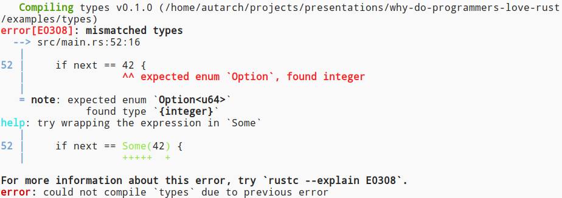

# Why Do Programmers Love Rust?

## Dave Rolsky

------


https://bit.ly/love-rust

Note:
* I encourage you to follow along on your own device. Some slides have
  detailed error messages that may be hard to read from afar.

------

## The Repo

https://bit.ly/that-repo

Note:
* Check out the repo for all example code

------

## This Is Not a Rust Tutorial

Note:
* But please do ask questions as we go.

------

## 2021 Stack Overflow Survey

[](img/most-loved.png)

<small>blue is love, purple is dread</small>

Note:
* Sadly, Perl did not do as well on this metric.

------

## Also 2016-2020 and 2022

Note:
* People *really* love Rust

------

## What's Your Context?

* Perl
* C
* C++
* Go

Note:
* Show of hands for each language.

------

## What Is Rust?

------

## "Systems" language

Note:
* But it's used for everything from embedded and kernels to CLI programs to
  services to games to frontend dev

------

## Compiled and Statically linked

Note:
* Except libc
    * Except when you statically link musl
* Compiler builds on top of LLVM.

------

## Type-Checked at Compile Time

Note:
* With a very powerful type system
* We'll look at some examples

------

## No Garbage Collection

But no manual memory allocation either

Note:
* Most things go on the stack by default
* But you can put things on the heap
* You can even replace the global allocator

------

## My Experience with Rust

* CLI tools
* GRPC backend
* Web frontend

Note:
* Started with some CLI tools
  * precious, ubi
* Later started writing a music player
  * importer
  * GRPC backend
  * web frontend using Dioxus

------

# So Why?

## [Reddit Thread on Why Rust Is So Loved](https://www.reddit.com/r/rust/comments/uboyeq/why_is_rust_the_most_loved_programming_language/)

Note:
* An /r/rust Reddit thread on why Rust is the most loved language.
* Here's what they mentioned, all of which agrees with what I like about Rust.

------

## Rust's Core Proposition

* Memory safety *and* performance
* Fearless concurrency
* Ownership of data as part of type system

------

## Language Features

* Strong type system
  * Enums
  * Traits
  * Generics
    * No nil values!
* Pattern matching
* Iterators
* Immutable by default
* Macros

Note:
* Type system doesn't have the challenges of pure functional programming
  * You won't hear the words "monad", "monoid", "category", or "arrow"

------

## Tooling

* `rustup`
* Compiler errors
* Cargo
* Tooling
  * `rust-analyzer`
  * `rustfmt`
  * `clippy`

------

## Ecosystem and Community

* Documentation
* Ecosystem
  * Serde
  * Rayon
* Community

------

## And One of My Favorites

* Very little "good enough for me but not for thee"

Note:
* Almost every feature in the language is implemented in an open way.
* For example, you can implement overloading for most operators.
* Almost every type is implemented in Rust.
* Most traits and macros are implemented in Rust.
* Any type can implement iteration.
* Relatively few features are implemented via magic in the compiler.

------

## Memory Safety

No returning pointers to the stack!

```rust
fn main() {
    returns_pointer();
}

fn returns_pointer<'a>() -> &'a u64 {
    let val = 42;
    return &val;
}
```

------

## Memory Safety

[](img/memory-safety.png)

------

## Memory Safety

* No double free!
* No single free!
* No pointers to freed memory!

Note:
* Rust frees allocated memory when a thing goes out of scope.
* All types can implement the `Drop` trait, similar to Perl's `DESTROY`.

------

## Memory Safety

Cannot read and write to the same thing at once!

```rust
fn main() {
    let mut vec = vec![1, 2, 3];
    for v in &vec {
        vec.push(v * 2);
    }
}
```

------

## Memory Safety

[](img/write-while-reading.png)

------

## Fearless Concurrency

No data races!

```rust
use std::thread;
fn main() {
    let mut v: HashMap<&str, u64> = HashMap::new();
    let mut handles = vec![];
    for _ in 1..10 {
        let h = thread::spawn(|| {
            let entry = v.entry("key").or_insert(1);
            *entry += 1;
        });
        handles.push(h);
    }
    // Wait for threads to finish
}
```

Note:
* Does anyone see the problem here?

------

## Fearless Concurrency

[](img/threads-with-shared-data.png)

------

## Fearless Concurrency

```rust
use std::sync::{Arc, Mutex};
fn main() {
    let v = Arc::new(Mutex::new(HashMap::new()));
    for _ in 1..10 {
        let v = Arc::clone(&v);
        let h = thread::spawn(move || {
            // Cannot read or write without the lock
            let mut lv = v.lock().unwrap();
            let entry = lv.entry("key").or_insert(1);
            *entry += 1;
            // Lock is released when `lv` goes out of scope
        });
    }
}
```

Note:
* An `Arc` is an atomically reference counted wrapper.
    * It allows for thread-safe shared ownership of a the value it wraps.
    * An `Arc` is read-only.
* The `Mutex` allows us to write to the shared data in a safe way.

------

## Type System - Enums

```rust
#[derive(Debug, PartialEq)]
pub enum Size {
    Small,
    Medium,
    Large,
}

pub fn match_size(size: Size) {
    match size {
        Size::Small => println!("It's small: {}", size),
        Size::Medium => println!("It's medium: {}", size),
        Size::Large => println!("It's large: {}", size),
    }
}
```

Note:
* A very trivial enum.
* The `derive` bit is a macro that implements various built-in traits (like roles or interfaces).

------

## Type System - Enums

What if we don't `match` every variant?

```rust
pub fn match_size(size: Size) {
    match size {
        Size::Small => println!("It's small: {}", size),
        Size::Medium => println!("It's medium: {}", size),
//        Size::Large => println!("It's large: {}", size),
    }
}
```

------

## Type System - Enums

[](img/enum-match-error.png)

Note:
* Tells me which variant I missed, where I missed it, and where the enum is defined.
* Also gives me a suggestion of how to fix it!

------

## Type System - Enums

```rust
struct Name {
    first: String,
    last: String,
}

enum Error {
    File(String),
    SizeExceeded(u64),
    BadName(Name),
}
```

Note:
* Enums can carry data in their variants.

------

## Traits

Note:
* Think roles, interfaces, etc.
* Many built-in traits that implement basic features like comparison, debug output, etc.
* You can write your own.
* You can implement *your own* traits on foreign types.
    * This is only in scope when you import the implementation!

------

## Type System - Traits

```rust
impl fmt::Display for Size {
    fn fmt(&self, f: &mut fmt::Formatter) -> fmt::Result {
        write!(f, "size = {:?}", self)
    }
}

println!("{}", Size::Medium);
```

Note:
* Example of a manual implementation of a trait that cannot be derived.
* The `Display` trait is how the curly braces in format string `{}` are implemented.
* It calls the `fmt` method on the thing in question.

------

## Type System - Traits

```rust
trait Reverse {
    fn reverse(&self) -> Self;
}

impl<T: Copy> Reverse for Vec<T> {
    fn reverse(&self) -> Self {
        let mut rev = Vec::with_capacity(self.len());
        for i in (0..self.len()).rev() {
            rev.push(self[i]);
        }
        rev
    }
}
```

Note:
* Defines and implements a trait named `Reverse`.
    * Implemented on a foreign type, `Vec` is part of the std lib.
* Also using generics.
    * For any type `T` which implements the `Copy` trait.
* Adds a method named `reverse` to those `Vec`s.

------

## Type System - Traits

```rust
pub fn reverse() {
    let v = vec![1, 2, 3];
    println!("Reverse of {:?} = {:?}", v, v.reverse());
}
```

Output is:

```sh
Reverse of [1, 2, 3] = [3, 2, 1]
```

------

## Type System - Generics

```rust
let mut map1 = HashMap::new();
// Type is inferred as HashMap<&str, &str>
map1.insert("hello", "world");

#[derive(Eq, Hash, PartialEq)]
struct MyStruct {
    name: String,
    length: u8,
}

let map2: HashMap<MyStruct, Vec<u64>> = HashMap::new();
```

Note:
* The `HashMap` type is generic over both keys and values.
* The keys must implement the `Eq` and `Hash` traits.
* Since `MyStruct` implements those traits we can use it as a `HasMap` key.

------

## Type System - Generics

```rust
#[derive(Default)]
struct Collection<T> {
    items: Vec<T>,
    counter: u64,
}
let mut coll = Collection::default();
coll.items.push(42);
coll.counter += 1;
```

Note:
* We can make our own generic types.
* The compiler infers the type of `T` here.


------

## Type System - Generics

```rust
#[derive(Copy, Default)]
struct Collection<T: Copy> {
    items: Vec<T>,
    counter: u64,
}
let mut coll = Collection::default();
coll.items.push(String::from("hello"));
coll.counter += 1;
```

Note:
* We can add bounds on our generic type.
* In this case we're saying that `T` must implement the `Copy` trait.

------

## Type System - Generics

[](img/generic-trait-bounds-error.png)

Note:
* The `String` type does not implement copy.

------

## Type System - No Nil Values

```
fn do_something() {
    let next = next_value(1);
    if next == 42 { ... }
}

fn next_value(v: u64) -> Option<u64> {
    if v == 42 {
        return None;
    } else if v > 42 {
        return Some(v - 1);
    }
    Some(v + 1)
}
```

------

## Type System - No Nil Values

[](img/option-instead-of-int.png)

Note:
* The compiler doesn't let us treat an `Option` as an integer.

------

## Type System - No Nil Values

```rust
fn do_something() {
    let next = next_value(42);
    match next {
        Some(n) => println!("Next == {}", n),
        None => println!("Found it!"),
    }
}
```

Note:
* When given an `Option` we must explicitly check for `None` somehow.

------

## Type System - No Nil Values

```rust
use std::fs::File;
fn open_file() {
    let file = File::open("/path/to/file");
    file.write("content");
}
```

Note:
* What do you think will happen here?

------

## Type System - No Nil Values

[](img/write-to-file-result.png)

------

## Type System - No Nil Values

```rust
use std::{fs::File, io::{self, Write}};

fn write_file() -> io::Result<()> {
    let mut file = File::options().write(true)
        .open("/path/to/file")?;
    file.write("content".as_bytes())?;
    Ok(())
}
```

Note:
* Fallible operations return a `Result`.
* We have to check that it's `Ok` before using it.
* The question marks are shorthand for that check.
* Note that our `write_file` function _also_ returns a `Result`.

------

## Type System - No Nil Values

```rust
use std::{fs::File, io::{self, Write}};
fn write_file() -> io::Result<()> {
    let file = File::options().write(true)
        .open("/path/to/file");
    let mut file = match file {
        Ok(f) => f,
        Err(e) => return Err(e),
    };
    match file.write("content".as_bytes()) {
        Ok(_) => Ok(()),
        Err(e) => Err(e)
    }
}
```

Note:
* Here's the longer version of what the question mark does, with some type
  conversion stuff omitted.

------

## Pattern Matching

```rust
fn main() {
    if let Some(val) = returns_option(true) {
        println!("val = {val}");
    }
}

fn returns_option(v: bool) -> Option<&'static str> {
    if v {
        Some("hello")
    } else {
        None
    }
}
```

Note:
* We already saw several `match` examples, but pattern matching can be used in
  other expressions.
* The `val` variable will contain `&str`, not an `Option`.

------

## Pattern Matching

```rust
struct Point {
    x: i32,
    y: i32,
}

let p = Some(Point { x: 1, y: 2 });
match p {
    Some(Point { x, y }) => println!("{x}, {y}"),
    None => println!("There's no point"),
}
```

Note:
* Can destructure structs and other types in a match.

------

## Pattern Matching

```rust
match p {
    Some(Point { x, y }) if x >= 0
        => println!("right: {x}, {y}"),
    Some(Point { x, y }) => println!("left: {x}, {y}"),
    None => println!("There's no point"),
}
```

Note:
* Matches can have conditional guards.
* Many other features to the match syntax.

------

## Iterators

```rust
fn main() {
    let vec = vec!["Dave", "Lisa", "Di Xin", "Laurent"];
    let lcd = vec
        .iter()
        .filter(|v| v.starts_with('D'))
        .map(|v| v.to_lowercase())
        .collect::<Vec<_>>();
    println!("lcd = {lcd:?}");
}
```

Note:
* Many built-in list comprehension methods.

------

## Iterators

```rust
struct Sequence {
    cur: u64,
}

impl Iterator for Sequence {
    type Item = u64;
    fn next(&mut self) -> Option<Self::Item> {
        let cur = self.cur;
        if cur > u64::MAX / 2 {
            None
        } else {
            self.cur = cur * 2;
            Some(cur)
        }
    }
}
```

Note:
* We can write our own iterators too!

------

## Macros

* Declarative macros
* Procedural macros
    * Derive macros
    * Attribute macros
    * Function-like macros

Note:
* Declarative versus procedural is based on how it's implemented, not just how
  they're used.
* Declarative macros are defined using a syntax sort of like pattern matching.
    * They generate code using something like variable interpolation.
* Procedural macros take a raw token stream in and generate a new stream of
  tokens.
* We've seen a number of macros so far, like `vec!`, `println!`, `#derive[]`,
  etc.

------

## Macros

```rust
// Declarative macro
let vec = vec![1, 2, 3];

// Derive macro
#[derive(Debug)]
struct Foo { ... }

// Attribute macro
#[trace]
fn some_func() { ... }

// Function-like
let sql = sql!(SELECT * FROM person WHERE name = 'Bob');
```

Note:
* Writing macros is a fairly advanced topic I won't get into, but it's very
  powerful.

------

# Any Language Questions So Far?

------

## Tooling - `rustup`

[rustup.rs](https://rustup.rs/)

```
$> rustup update

$> rustup component add rustfmt
```

Note:
* Will install the latest stable release.
    * The compiler, `cargo`, docs, `clippy`, and `rustfmt`.
* Can install multiple releases of Rust and switch between them easily.
* Can install toolchains for other architectures to support cross-compilation.

------

## Tooling - Cargo

```
$> cargo new some-program

$> cargo new --lib some-lib

$> cargo build

$> cargo test

$> cargo run
```

Note:
* This makes a new crate, which can be an executable or a library.
    * The default is an executable.
* You also use cargo to build and test code.
* And you can run code with cargo and pretend Rust is a scripting language.

------

## Tooling - Cargo

```toml
[package]
name = "precious"
version = "0.1.3"
authors = ["Dave Rolsky <autarch@urth.org>"]
description = "One code quality tool to rule them all"
repository = "https://github.com/houseabsolute/precious"
readme = "README.md"
license = "MIT OR Apache-2.0"
edition = "2018"

[dependencies]
anyhow = "1.0.53"
clap = ">= 3.0.14, < 3.1.0"
fern = { version = ">= 0.5.0, < 0.7.0", features = ["colored"] }
globset = "0.4.8"
ignore = "0.4.18"
indexmap = { version = "1.8.0", features = ["serde"] }
itertools = ">= 0.9.0, < 0.11.0"
log = "0.4.14"
md5 = "0.7.0"
path-clean = "0.1.0"
pretty_assertions = "1.1.0"
rayon = "1.5.1"
serde = { version = "1.0.136", features = ["derive"] }
thiserror = "1.0.30"
toml = "0.5.8"
which = ">= 3.0.0, < 5.0.0"

[dev-dependencies]
serial_test = "0.5.1"
tempfile = "3.3.0"

[workspace.metadata.release]
allow-branch = ["master"]
```

Note:
* Every crate has a `Cargo.toml` file:
    * Metadata like the crate name and version
    * Dependencies
    * Features, which are compile-time options
* Cargo "plugins" can also read this file and use it for config.

------

## Tooling - `cargo-edit`

```
$> cargo install cargo-edit

$> cargo add serde --features derive

$> cargo rm log

$> cargo upgrade
```

Note:
* One of my favorite cargo add-ons.
* Some of its functionality has been added to the core already.

------

## Tooling - Clippy

```
$> cargo clippy

$> cargo clippy --fix
```

Note:
* Linting beyond compiler warnings.
* A lot like `perlcritic`.
* Can enable/disable lints via config.
* Can enable/disable lints for blocks of code via directive comments.

------

## Ecosystem - Documentation

```rust
/// foo is a function that returns **very dangerous data**!
/// Never call it with anything larger than `50`.
fn foo(size: u32) -> Data {}
```

```
$> rustdoc src/lib.rs

$> cargo doc
```

Note:
* Embedded docs, just like perldoc.
* Uses Markdown.
* `rustdoc` generates HTML docs.
* When you run `cargo test` it tests code embedded in docs by default.

------

## Ecosystem - Crates

[crates.io](https://crates.io/)

[lib.rs](https://lib.rs/)

[doc.rs](https://docs.rs/)

Note:
* "Crates" are Rust's name for packages, both libraries and executables.
* crates.io is the official package repo
    * Like CPAN.
* lib.rs has a much better search system
    * Like MetaCPAN.
* doc.rs has docs for everything uploaded to crates.io

------

## Community

[www.rust-lang.org/community](https://www.rust-lang.org/community)

Note:
* Web forums
* Various Discord servers
* Zulip chat
* This Week in Rust
* My experience with the Rust community has been very positive. People are
  friendly and welcoming, and bad behavior is not tolerated.

------

# Questions?

------

# Thank you

------

# Bonus Slides

------

## Pattern Matching

```rust
while let Ok(val) = try_write(...) { }
```

------

## Pattern Matching

```rust
match val {
    1 | 2 => ...,
    3 => ...,
    _ => ....,
}
```

Note:
* Can match against multiple values, like `1 | 2`.
* The underscore in the match means "all other values".
